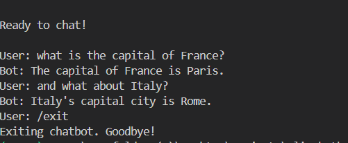

---

##  **Final Updated README.md**

```
# Local Command-Line Chatbot (Hugging Face)



A fully functional **local chatbot interface** built in Python using the Hugging Face `transformers` library.  
It runs a small, modern language model locally to maintain coherent, multi-turn conversations — without using any APIs or internet connection.

---

##  Demo Video

 **Watch the full working demo here:**  
 [Click to View on Google Drive](https://drive.google.com/file/d/1x_clJwC3SlTmh02QT2EtfpNCz6rll_PU/view?usp=sharing)

---

##  Features

- **100% Local Inference:** Runs entirely on your own machine — no API calls.
- **Auto-Detects Hardware:** Automatically uses your NVIDIA GPU (CUDA) if available; otherwise falls back to CPU.
- **Modern Chat Model:** Uses `TinyLlama/TinyLlama-1.1B-Chat-v1.0`, a small but powerful model that is both **factual** and **conversational**.
- **Robust Context Management:** Utilizes Hugging Face’s `tokenizer.apply_chat_template()` to properly format conversation history.
- **Sliding Window Memory:** Remembers the last 5 turns of conversation using a `deque` collection.
- **Modular Codebase:**
  - `model_loader.py` → Loads model & tokenizer, auto-detects GPU/CPU.
  - `chat_memory.py` → Manages recent chat history efficiently.
  - `cli_interface.py` → Main file for running the chatbot.
- **Built-in CLI Commands:**
  `/exit`, `/help`, `/history`, `/clear` for complete chat control.

---

##  Installation & Setup

### 1️ Clone the Repository

```bash
git clone https://github.com/Gaurav9693089415/cli_chatbot.git
cd cli_chatbot
````

### 2️ Create and Activate Virtual Environment

```bash
# Create virtual environment
python -m venv myenv

# Activate it
# On Windows
myenv\Scripts\activate
# On macOS/Linux
source myenv/bin/activate
```

### 3️ Install Dependencies

Create a file named `requirements.txt` and add:

```txt
transformers>=4.35.0
torch>=1.13.0
sentencepiece
accelerate
```

Then install them:

```bash
pip install -r requirements.txt
```

---

##  How to Run

The script automatically detects your hardware and uses GPU if available.

```bash
python cli_interface.py
```

---

##  Example Interaction

```bash
============================================================
 LOCAL COMMAND-LINE CHATBOT
============================================================
Welcome! Type your messages below.

Available commands:
  /exit     - Exit the chatbot
  /help     - Show this help message
  /history  - Show conversation history
  /clear    - Clear conversation history
============================================================

Ready to chat!

User: What is the capital of France?
Bot: The capital of France is Paris.

User: And what about Italy?
Bot: The capital of Italy is Rome.

User: /exit
Exiting chatbot. Goodbye!
```

---

##  Project Structure

```
cli_chatbot/
├── model_loader.py       # Handles model & tokenizer loading
├── chat_memory.py        # Manages conversation memory
├── cli_interface.py      # Main chat interface and loop
├── requirements.txt      # Dependencies
├── demo_screenshot.png   # Project demo image
└── README.md
```

---

##  Design Decisions

* **Model Choice:**
  `TinyLlama/TinyLlama-1.1B-Chat-v1.0` was selected because it’s small, fast, and instruction-tuned — ideal for local systems with limited VRAM while maintaining conversational accuracy.

* **Context Management:**
  The `tokenizer.apply_chat_template()` method dynamically formats the prompt for multi-turn conversations, allowing smooth follow-up question handling like “And what about Italy?”.

* **Efficiency:**
  Model is loaded in `float16` precision (FP16) on GPU to reduce VRAM usage and improve speed.
  Chat memory uses a fixed-length `deque` for efficient sliding-window context management.

---

##  Example Explanation for Demo (Optional)

> “I chose TinyLlama because it’s a small, fast, and modern chat model that runs locally on normal hardware while still giving accurate, conversational answers.”

---

##  License

This project is open-source and available under the **MIT License**.

---

##  Author

**Gaurav Kumar**
GitHub: [@Gaurav9693089415](https://github.com/Gaurav9693089415)

````


